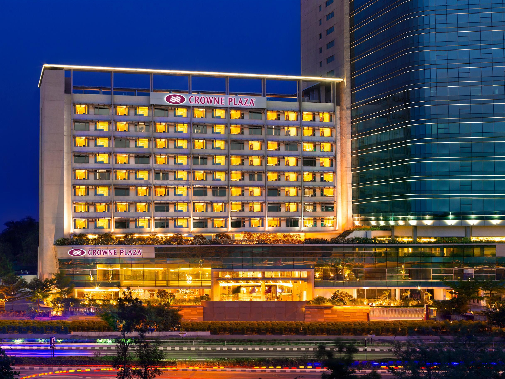

```{r setup, include=FALSE}
knitr::opts_chunk$set(echo = TRUE)
knitr::opts_chunk$set(warning = FALSE)
knitr::opts_chunk$set(message = FALSE)
knitr::opts_chunk$set(cache = TRUE)
```

<style>
#watermark-logo {
  position: fixed;
  bottom: 25px;
  left: 25px;
  width: 100px;
  opacity: 1;
  z-index: 9999;
}
</style>




[Hotel Booking Reservation Dataset](https://www.kaggle.com/datasets/kundanbedmutha/hotel-booking-reservation)

# Step 0 - Why?

We have been hired by IHG, a global Hotel and Resorts brand, to help the Management of the City Hotel Ahmedabad, India minimize revenue loss through late cancellations that leave rooms empty. Our business problem is pretty simple: we’re a high-end hotel that wants to predict which reservations are likely to cancel before the guest ever shows up. Because cancellations are common, hotels usually “overbook” a little bit to avoid having empty rooms. But if we overbook too aggressively and the guests don’t cancel, we end up with more people than rooms and have to send someone to another hotel and compensate them. On the other hand, if we play it too safe and don’t overbook at all, we leave expensive rooms empty. 

We act as consultants, and management has provided us with a data set of 4,850 reservations with 27 variables plus the final binary outcome is_canceled, which is 1 if the guest cancelled and 0 if they actually stayed. We are trying to predict this outcome through the other variables that describe what the hotel already knows at booking time like lead time, length of previous stay, number of guests, room type, booking channel, and previous cancellations.

In this project our prediction task is to estimate, for each new booking, the probability that it will be canceled. We build and compare several models including Logistic Regression, k-Nearest-Neighbours, Artificial Neural Network, Decision Tree, Random Forest, and a Support Vector Machine.
We'll then build a stacked meta model (second layer decision tree) that uses the predicted probabilities from the base models as inputs and produces a final cancellation probability which the hotel can use when setting its overbooking policy.

We will evaluate the differences between all individual models and the stacked model in classic statistical metrics and by computing the expected net financial impact of model implementation. From this analysis, we are able to provide management with a recommendation of which model to implement and how to do so. 

There is quite a high cancellation rate. Thus, it is worth investigating how much we should allow overbooking.

# Step 1&2&3: Load, Clean, and Split Data

Refer to the *data_cleaning_splitting.Rmd* under the data folder.

```{r data}
source("data/data_cleaning_splitting.R")
```

## Step 4&5: Create, Predict Models


### Logistic Regression

```{r logistic_regression_results}
source("models/LogisticRegression.R")
```

### KNN

```{r knn_results}
source("models/KNN.R")
```

### ANN
```{r ann_results}
source("models/ANN.R")
```

### SVM
```{r svm_results}
source("models/SVM.R")
```


### Decision Tree

```{r dt_results}
source("models/DecisionTree.R")
```


### Random Forest

```{r rf_results}
source("models/RandomForest.R")
```


## Step 6: Combine Models


```{r stacked_dt, cache=FALSE}
source("models/metaDT.R")
```

```{r stacked_lr, cache=FALSE}
source("models/StackedLR.R")
```


Given that giving someone a room at a different hotel plus compensation is about twice as expensive as an empty $500 room, the Random Forest with threshold 0.55 is the cheapest policy: it creates the lowest average loss per reservation. The other models either send too many guests away to other hotels or leave too many rooms empty, so their average cost per booking is higher.

Looking at the table itself, each row is the “best” version of that model once we plug in our cost numbers. The Threshold column shows how high the predicted cancel-probability has to be before we treat a booking as a cancellation risk. Models with very high thresholds like the ANN at 0.99 are extremely picky and only flag the riskiest guests, which gives them huge Precision but lower Sensitivity because they miss a lot of actual cancellations. On the other side, the logistic model at 0.01 basically flags almost everyone, so its sensitivity is higher but its precision drops. Accuracy and Kappa summarize overall performance, but the main number we care about is AvgCost, which turns all those trade-offs into an estimated dollar loss per reservation. Random Forest ends up with the lowest AvgCost, while the stacked model and SVM are close behind, and the ANN is the most expensive because it leaves too many empty rooms.

with cost matrix (?)

without cost matrix (??)


## Step 7: Final Prediction


## Step 8: Model Evaluation


## Step 9: Implications, Limitations, and Further Steps

Limitations: Did not explore financial impact by having a policy that 

Dynamic
