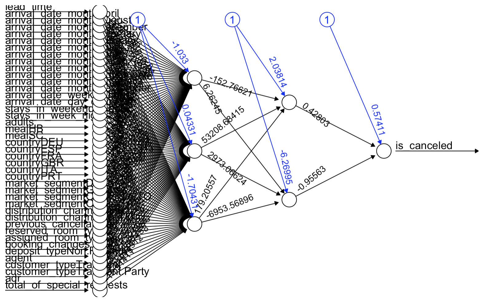

```{r setup, include=FALSE}
knitr::opts_chunk$set(echo = TRUE)
knitr::opts_chunk$set(warning = FALSE)
knitr::opts_chunk$set(message = FALSE)
knitr::opts_chunk$set(cache = FALSE)
```

<style>
#watermark-logo {
  position: fixed;
  bottom: 25px;
  left: 25px;
  width: 100px;
  opacity: 1;
  z-index: 9999;
}
</style>


[Hotel Booking Reservation Dataset](https://www.kaggle.com/datasets/kundanbedmutha/hotel-booking-reservation)

## Step -1 - Explanation of Methodology

folder structure etc.

# Step 0 - Why?

We have been hired by IHG, a global Hotel and Resorts brand, to help the management of the City Hotel Ahmedabad. IHG has been facing the problem of revenue loss due to room cancellations. It is shown that around 40% of rooms are canceled after booking. Because cancellations are common, hotels usually “overbook” a little bit to avoid having empty rooms. IHG does not wish to overbook too aggressively since they would have to compensate the guests with a better room and compliments. On the other hand, if we play it too safe and don’t overbook at all, we leave expensive rooms empty. This prompts IHG to explore models that would allow them to overbook the rooms to minimize missed revenue. We aim to predict which reservations are likely to cancel before the guest shows up. 

We act as consultants, and management has provided us with a data set of 4,850 reservations with 27 variables plus the final binary outcome is_canceled, which is 1 if the guest cancelled and 0 if they actually stayed. We are trying to predict this outcome through the other variables that describe what the hotel already knows at booking time like lead time, length of previous stay, number of guests, room type, booking channel, and previous cancellations.
	
In this project our prediction task is to estimate, for each new booking, the probability that it will be canceled. We will build and compare several models including Logistic Regression, KNN (k-Nearest-Neighbours), ANN (Artificial Neural Network), Decision Tree, Random Forest, and Support Vector Machine. We aim to optimize precision since we would want to avoid false positives (predicting the guest to cancel but they actually show up) which would incur extra cost. We'll then build a stacked meta model (second layer decision tree) that leverages the predicted probabilities from the base models as inputs and produces a final cancellation probability which the hotel can use when setting its overbooking policy.

We will evaluate the differences between our baseline without a model, all individual models, a very conservative logistic regression model that prioritizes minimizing false positives, and the stacked model in classic statistical metrics and compute the expected net financial impact of model implementation. From this analysis, we are able to provide the management with a recommendation of which model to implement and how to do so. They will also be able to optimize room reservations to prevent revenue loss due to empty rooms and overbooking.

# Step 1 & 2 & 3 : Load, Clean, and Split Data

Refer to the *data_cleaning_splitting.R* under the data folder.

```{r data}
source("data/data_cleaning_splitting.R")
```

# Step 4 & 5 & 6 : Create, Predict and Evaluate Models

## First-level Models

### A - Logistic Regression

We built a logistic regression model as our baseline, starting with all available predictor variables and an initial AIC of 2590.027. We used backward stepwise selection, which removed variables one at a time to find the model with the lowest AIC, and over 8 steps we dropped variables like distribution channel, arrival date features, country, room type, market segment, meal type, and number of adults, ultimately reducing the AIC to 2578.054. After finding our best model, we tested 99 different probability thresholds to determine when to classify a booking as canceled, and the threshold that maximized precision was 0.92 (but 0.99 resulted in less revenue lost), meaning we only predict cancellation when we're extremely confident. Our goal was to create a conservative baseline model in which we also had to accept that we'd miss many actual cancellations in order to avoid false positives. We only caught about 38% of actual cancellations for an overall accuracy of 73.09%. The monetary results from this conservative approach were promising though, because there was a significant reduction in lost revenue with this model.

Accuracy: 0.731
Sensitivity: 0.569
Specificity: 0.902
Precision: 0.80


```{r logistic_regression_results}
source("models/LogisticRegression.R")
```

### B - KNN

```{r knn_results, cache=FALSE}
source("models/KNN.R")
```

In order to optimize the KNN model, we tuned k by testing different values from 0 to 31. After obtaining the accuracy, sensitivity and specificity for each K, we have selected the one with the highest specificity. This is because false positives, predicting a cancellation when the guests actually show up, are very expensive. We want a model that can correctly identify non-cancellations.

Accuracy: 0.731
Sensitivity: 0.5691
Specificity: 0.9022
Precision: 0.80

### C - ANN



```{r ann_results, cache=FALSE}
source("models/ANN.R")
```

Due to expensive computations using ANN, we took a subset of the train data since the full dataset takes more than 20 minutes to knit. We played around with different neurons in two layers and ultimately applied 3 neurons for the first layer and 2 neurons for the second layer.

### D - SVM

```{r svm_results}
source("models/SVM.R")
```

We put three SVM kernels- linear, radial, and sigmoid- into trials to look for the optimal kernel. The linear kernel slightly outperformed radial, so we applied it for the final model.

Accuracy: 0.7897
Sensitivity: 0.6615
Specificity: 0.8868
Precision: 0.816

### E - Decision Tree


```{r dt_results}
source("models/DecisionTree.R")
```

The decision tree is optimized using a trial of 10.
Accuracy: 0.8057
Sensitivity: 0.9004
Specificity: 0.6806
Precision: 0.838

### F - Random Forest


```{r rf_results, cache = FALSE}
source("models/RandomForest.R")
```

To model cancellation behaviour, we trained a Random Forest classifier. We tuned the number of trees (ntree) by testing values from 100 to 2000 in steps of 100, using out-of-sample precision as the primary metric. Performance plateaued quickly, and 300 trees delivered the best balance of accuracy, sensitivity, and precision, so we selected ntree = 300 for the final model.


## Evaluating first level Models

#### Summary for First-Level Models
	
The six base models we used are optimized with their respective parameters and thresholds. Random forest is especially outperforming the other models, giving good combinations of the metrics. These base models provide a good foundation for our stacked model.

#### Introducing Cost Matrix 

Cost Matrix
True Positives: predict cancel, and actually cancel
There will be a cost of $\$0$ since the room will not be left empty.
True Negatives: predict no cancel, and actually no cancel
There will be a cost of $\$0$ since the room will not be left empty.
False Positives: predict cancel, and actually no cancel
There will be a cost of $\$1200$. This is because we canceled the room but the guest actually showed up. We must make it right. Therefore, we will have to accommodate them in a suite at our sister hotel which would cost us $\$800$ as well as offer some discounts and compliments worth around $\$400$.
False Negatives: predict no cancel, but actually cancel
There will be a cost of $\$500$. This is because we predicted them to not cancel but they actually canceled. The room will be left empty and we would not have earned the $\$500$.


```{r comp}
source("models/base_comparison.R")
```

Looking at the table itself, each row is the “best” version of that model once we plug in our cost numbers. The Threshold column shows how high the predicted cancel-probability has to be before we treat a booking as a cancellation risk. Models with very high thresholds like the ANN at 0.99 are extremely picky and only flag the riskiest guests, which gives them huge Precision but lower Sensitivity because they miss a lot of actual cancellations. On the other side, the logistic model at 0.01 basically flags almost everyone, so its sensitivity is higher but its precision drops. Accuracy and Kappa summarize overall performance, but the main number we care about is AvgCost, which turns all those trade-offs into an estimated dollar loss per reservation. Random Forest ends up with the lowest AvgCost, while the stacked model and SVM are close behind, and the ANN is the most expensive because it leaves too many empty rooms.

Given that giving someone a room at a different hotel plus compensation is about twice as expensive as an empty $500 room, the Random Forest with threshold 0.55 is the cheapest policy: it creates the lowest average loss per reservation. The other models either send too many guests away to other hotels or leave too many rooms empty, so their average cost per booking is higher.

As the ANN-Model is evidentely much worse than the other first-level models and as it was only trained on 30% of the test set, we have decided against incorporating it in the stacked models.


## Stacked Models

We split 50-50 on the original 40% of test data. (this turns out to be 20% train and 20% test of the original data-set, so 970 rows each).
We are attempting to leverage the strengths of each base model and come up with a second-level model. 
First, we chose a decision tree as our second-level model because of its ability to not merely average predictions, but aggregate the strengths of each base model. We are also applying the defined cost matrix based on our context of the business problem.

### Second-layer Decision Tree

```{r meta_dt}
source("models/metaDT.R")
```

The stacked decision tree model turns out to only use random forest as its predictor. This makes sense as random forest was outperforming the other base models. However, this also means that the random forest base model is sufficient for predicting.

This is why we explore other options for stacking, namely a meta Logistic Regression Model and a meta Random Forest Model
### Second-layer Logistic Regression

```{r stacked_lr}
source("models/StackedLR.R")
```

Because the Random Forest Model still slightly outperforms the stacked models even if evaluated on the same test-set, we recommend utilizing this model.

# Step 7: Implement Model

We have found that the base models were fairly reliable at predicting Hotel booking cancellation. We ultimately decided to use the base random forest model as our final model, which gives an 82.1% accuracy and precision of 87.8%. Considering the financial implications based on our initial assumptions, the revenue loss due to empty rooms and overbooking reduced the average booking costs from $\$215$ to $\$110$. This corresponds to a relative decrease of 49%, and would mean $\$509,250$ of additional revenue per fiscal year for The City Hotel. We have calculated this number by multiplying the cost difference ($\$105$) by the number of reservations (4,850). These are excellent results even though I have not taken deeper exploration into the different variables or refined the assumptions.

## Next Steps

Our plan is to start using the Random Forest Model daily to predict cancellation of future bookings. We will use an optimized probability threshold of 55% to classify whether a cancellation is expected or not. It will deploy real-time prediction in the booking system, so if a cancellation is expected, it will make the room available for booking again.
This model would need to be optimized regularly with further exploration and considering the following limitations mentioned. This means that it would have the models retrained continuously with new and up-to-date data.

## Future Explorations

#### 1. Extend relevance beyond saturated occupancy
The predictive model only generates economic value on nights when the hotel expects to be fully booked or nearly full.
Our cost structure assumes that every cancelled reservation translates into $500 of lost revenue, which is only true when demand is high.
On low-demand nights, a cancellation often has no financial impact at all.
Our estimated savings overstate the real-world benefit unless the model is used selectively during peak periods or paired with a demand-forecasting module.

#### 2. Endogenize cost structure
To keep the business problem tractable, we use a simple cost matrix:
each room is treated as a single night at 500 dollars
a cancellation always triggers a full refund
a cancelled room is never rebooked
Reality is more messy:
Many reservations last several nights and the price per night changes with season, weekday and channel. Our model compresses all of that into one average 500 dollar number, so it is too conservative on high value nights and too aggressive on low value ones.
We treat all cancellations as equally painful, whether they happen eleven months before arrival or at 18:00 on the check in day. In practice, early cancellations are often harmless because the room can be resold, while last minute cancellations are the ones that really hurt. Our loss matrix cannot see this timing difference.
We assume a cancelled room can never be filled by walk in guests, last minute deals or corporate contracts. If in reality the hotel is quite good at reselling late cancellations, then we overstate the true cost of false negatives and our “optimal” threshold is too pessimistic.
The acceptable level of overbooking changes with time to arrival, season and special events. A booking for peak season may deserve a different threshold from a booking on a quiet weekday.
So the cost matrix should be read as a scenario that clarifies the logic of the problem, not as an exact accounting statement.

#### 3. Implement customer loyalty and Human Resource regards
Our optimisation target is “average loss per reservation” computed from the confusion matrix and the cost matrix. This focuses entirely on direct cash flow: empty rooms and overbookings.

This is a deliberate simplification, but it ignores several other dimensions that matter to a high end brand:
All guests look identical to the model. It does not distinguish between a loyal frequent guest whose disappointment could be very costly in the long run and a one time visitor.
The impact of a very bad overbooking experience on reviews, social media and future demand is not modelled. Ten slightly empty nights may be better for the brand than one highly visible service failure.
Operational stress is ignored. Repeated overbooking incidents can increase staff workload, require managers to negotiate with partners and generally make the hotel harder to run.
In that sense, our “best” model is best only with respect to a narrow financial objective. Management should still layer strategic judgement on top of it.

#### 4. Include other potential drivers of cancellation
Our data contains 4,850 bookings for one hotel, with rich information on dates, party size, booking channels, previous cancellations and some price-related variables. At the same time, some important drivers of cancellations are missing or very coarse.
We do not observe income, detailed loyalty status, corporate contract identifiers or purpose of travel. A corporate group with twenty rooms cancelling once a year behaves very differently from a family booking through an online agent. The model cannot see this difference except indirectly through rough proxies.
Many guests only appear once in the data set. For them the model has to rely entirely on general patterns. As a result, it can be confidently wrong in cases where reservation agents would have useful context that never enters the system.
Because the data comes from a single hotel and a specific time period, it may contain idiosyncratic patterns related to local events, temporary promotions or internal policies that are not explicitly coded. The model may treat these as structural relationships even though they will not repeat.
These blind spots mean that even a highly accurate model will sometimes misclassify bookings for reasons that have nothing to do with its “skill,” and they limit how far we can push overbooking based solely on predicted probabilities.
